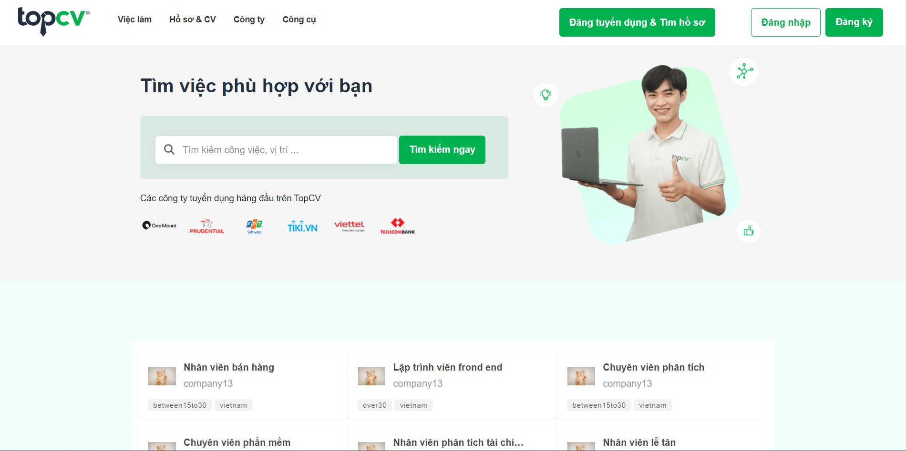

# TopCV UI Clone

## [My Live Website](https://topcv-clone.netlify.app)

# Welcome! 👋

To run project run `npm start` then `react-scripts start`
Require .env file with following format:

PORT=

## Overview ✨

### The Recruit Website

Your users can be able to:

-   Signup Signin with web account or Google account (Forgot password with mail sending)
-   Change information for user ( username, password, `upload avatar`, ... )
-   Candidate can upload CV to employer (AWS S3 storage)
-   Candidate can follow company to get the newest jobs (notification)
-   Management jobs and cv for users with `company` role
-   Admin page to manage for users with `admin` role
-   **Bonus**: Live chat realtime between company and candidate (Socket)

_Alert:_ No responsive (Best perform 1920x1080), Language supported only Vietnamese.

## Technologies

-   Client: React, SocketClient
-   Server: NestJS, Typescript, MySQL, Socket, AWS S3 [Server source](https://github.com/MingZoox/topcv_clone-api)
-   Details in package.json file

## Got feedback ?

It's just my simple and messy project I build in my free time to practice what i have learned.
So i would very appreciate if you have any feedback.
Please contact email lephucthiep2785@gmail.com

**Feel free to fork !** 🚀
1
